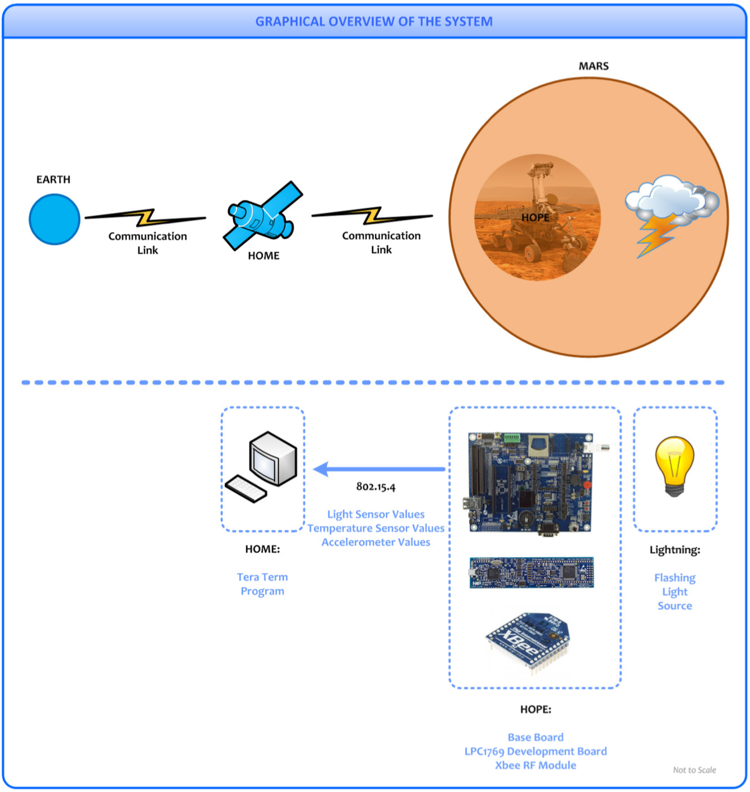

# Embedded Programming: Emulating a Mars Rover
This project was done as a part of **EE2024: Programming for Computer Interfaces** at National University of Singapore (NUS). Project owners: Naman Sharma, Pan Jieming. The aim of the project was to emulate a robotic mission sent to mars using a FPGA (LCP1769 in this case, with a basebard consisting of multiple sensors). This mars rover is named **HOPE**, short for Habitability Observer ad Precursory Explorer. The mars rover is supposed to collect various sensor readings and send these back over to the base station using wireless communication.

## Detailed Description and Specifications for HOPE
1. The three sensors on board HOPE are: accelerometer, light intensity sensor and temperature sensor.

    a. Accelerometer: Used as an inclinometer for HOPE, to prevent it from getting into an unrecoverable position while moving around the terrain of Mars
    
    b. Light sensor: Dust storms on Mars create lightning, and the presence of these dust storms require the robot to go into a `SURVIVAL` mode.

    c. Temperature sensor: The temperature of te sstems needs to be maintained within an appropriate range, and therefore temperature measurement is crucial.

2. HOPE has two modes of operation: `EXPLORER` and `SURVIVAL`. The explorer goes through an initialization phase when it starts up, where the `segment_display` counts up from 0-6, A-F and then starts in the `EXPLORER` mode.
3. In the `EXPLORER` mode, all three sensors are sampled at intervals of `SAMPLING_TIME` and the readings are shown on the graphics display. hese values are also to `HOME` using a UART wireless interface.
4. HOPE automatically enters into a `SURVIVAL` mode as son as the light sensor detects `LIGHTNING_THRESHOLD` being crossed at least three times within a time frame of the past `LIGHTNING_TIME_WINDOW`. When HOPE goes into `SURVIVAL` mode, it performs the following actions:

    a. `INDICATOR_SURVIVAL` LED will turn on, and the `INDICATOR_EXPLORER` LED will switch off.
    
    b. The graphics display will stop showing all sensor values and all measurements from the sensors will stop. 

    c. HOPE send a message to `HOME` alerting it that survival mode has been activated, and no more senosr values will be sent back to the base station.

    d. Provided that the luminance level from the light sensor is below `LIGHTNING_MONITORING`, another LED from the `INDICATOR_ARRAY` will turn off for every `TIME_UNIT` that has passed.

    e. Any time that the luminance level from the light sensor is above `LIGHTNING_MONITORING`, `INDICATOR_ARRAY` will turn on all the LEDs and restart the countdown sequence described above.

    f. If all LEDs of `INDICATOR_ARRAY` are off, HOPE automatically enters the `EXPLORER` mode, sendng a message to HOME stating that the `SURVIVAL` mode has ended and it will begin sending sensor data.

The `SURVIVAL` mode of HOPE has been programmed using interrupts, to allow for immediate switching between the modes. The parallels between the scenario and the actual setup are shown in the graphical overview of the system below:

## Code Structure Description
1. `Report.pdf` : Contains detailed description of code, including flowcharts of decision steps.
2. `Code/src/Assignment2.c` : Main file for the code. Includes the code for intializing the various peripherials using I2C, SSP, GPIO etc. Defines the use of various interrupt handlers such as `TIMER0_IRQHandler` (for updating LED precisely at 1s) and `EINT3_IRQHandler` (for switching from `EXPLORER` mode to `SURVIVAL` mode). The `main()` function handles reading the different sensors and transmission of the data to the base station.